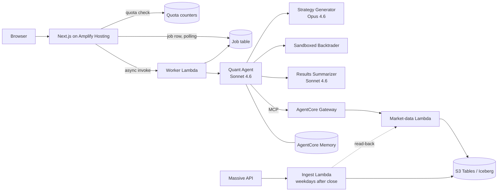

# Agentic Backtester

Describe a trading strategy in plain English and get back a backtest: a team of AI agents writes the strategy as code, pulls historical market data, runs the simulation, and writes up the results. Coordinated on Amazon Bedrock AgentCore, hosted publicly on AWS.

**Live demo: https://main.d1x6utcih65eg5.amplifyapp.com** — runs on a capped personal budget, so capacity is limited to a handful of backtests a day.

## Disclaimer

**This project is for educational and research purposes only.** The backtesting results, trading strategies, and any analysis it produces do not constitute financial advice, investment recommendations, or an offer to buy or sell any securities. Past performance does not guarantee future results. Trading and investing involve substantial risk of loss. Always consult a qualified financial advisor before making investment decisions.

## How it works

A backtest request is queued and handed to a worker, which invokes the **Quant Agent** (Claude Sonnet 4.6). The Quant Agent orchestrates four steps:

1. **Strategy Generator** (Claude Opus 4.6, its own AgentCore runtime) turns the strategy into [Backtrader](https://www.backtrader.com/) Python code.
2. **Market data** comes over MCP from an AgentCore Gateway (Cognito machine-to-machine auth), backed by a Lambda that reads an S3 Tables (Apache Iceberg) table. The fetch checks the dates it got against the dates it asked for, and flags any gap.
3. **Backtest** runs the generated code through Backtrader after static validation and inside a restricted namespace.
4. **Results Summarizer** (Claude Sonnet 4.6, its own runtime) returns a schema-validated report built from statistics computed in Python.

Market data is ingested from the [Massive](https://massive.com) API (US equities) by a scheduled pipeline, and AgentCore Memory lets a chat view answer questions about past runs.

## What I built on top of the sample

The project started from an AWS workshop sample. The core idea of agents that write, run and explain a strategy is theirs. Most of my work went into making it trustworthy and safe to run in public, because a backtester's real failure mode isn't crashing. It's returning a confident, well-formatted, wrong answer, and most of the bugs I found here were exactly that.

- **Real market data, kept current.** A pipeline ([`market-data-pipeline/`](./market-data-pipeline)) replaced the sample's single stale CSV with five symbols from Massive. Every write is an Iceberg filtered overwrite (atomic delete-then-insert), so re-runs are idempotent and duplicate rows are structurally impossible. Existing history is preserved and extended, which keeps AMZN back to 2000 even though the data plan only serves five years. The vendor silently clamps requests that go past the plan limit, so the pipeline checks coverage explicitly. It runs on a schedule, reads its own output back through the agent's data path, and alarms both on failure and on silence.
- **Deterministic work kept out of the model.** The model has no clock and was backtesting year-old windows, so dates are now resolved in code for every request. The summarizer's arithmetic moved to Python, which made it both faster (116s to 26s) and more accurate. Its hand-computed figures had been wrong.
- **Structured outputs.** The agents moved from Strands to Pydantic AI, and the report is a typed, validated schema rather than parsed free text.
- **Sandboxed generated code.** LLM-written Python is checked against an import and attribute allowlist, then executed with restricted builtins. This is defence in depth, not true isolation, and that limit is documented.
- **Public hosting with cost controls.** Backtests are measured at about $0.22 each, about 90% of it model calls. Atomic DynamoDB counters cap usage per day and per month, and an AWS Budget tracks *gross* usage, because promotional credits make the net figure read $0. Amplify's SSR has a hard 30-second limit, so model calls run in an async worker. Retries are disabled on that path after one click was measured producing seven full agent runs.
- **Owned infrastructure.** Four AWS CDK stacks ([`infra/`](./infra)) replace the sample's shell scripts: data, backend (Lambda, Cognito, Gateway), hosting guardrails and the ingest pipeline. The agents are one `@aws/agentcore` CLI project.

## Tech stack

- **Amazon Bedrock AgentCore**: Runtime, Gateway (MCP), Memory, Observability
- **Pydantic AI** on Amazon Bedrock (Claude Opus 4.6, Claude Sonnet 4.6)
- **S3 Tables (Apache Iceberg)** via PyIceberg, **Lambda**, **DynamoDB**, **EventBridge**, **CloudWatch**
- **AWS CDK (Python)** for infrastructure
- **Next.js 14 / React** on **AWS Amplify Hosting**
- **Massive** REST API for market data

## Repository layout

| Path | What it is |
| --- | --- |
| [`agents/`](./agents) | The three agents, as one AgentCore CLI project |
| [`backtest-worker/`](./backtest-worker) | Lambda that runs a backtest or chat turn outside the web request |
| [`frontend/`](./frontend) | Next.js app: strategy form, results, chat |
| [`infra/`](./infra) | AWS CDK stacks |
| [`market-data-mcp/`](./market-data-mcp) | The market-data Lambda behind the Gateway |
| [`market-data-pipeline/`](./market-data-pipeline) | Massive ingest, CLI and scheduled Lambda |

## Running it

**[DEPLOYMENT_GUIDE.md](./DEPLOYMENT_GUIDE.md)** walks through deploying everything into your own AWS account.

## Roadmap

- [x] Market-data pipeline from Massive (multi-symbol, scheduled, verified)
- [x] Public hosting with cost guardrails
- [ ] News as a signal: a `fetch_news` tool and a typed news-analyst sub-agent
- [ ] Walk-forward testing and parameter optimisation
- [ ] Sign-in, and per-user limits

## Credits

Originally based on the AWS Samples [`sample-tech-for-trading`](https://github.com/aws-samples/sample-tech-for-trading) project (`agentic_backtesting/`), released under MIT-0. Extended and maintained by Jude Pereira.
