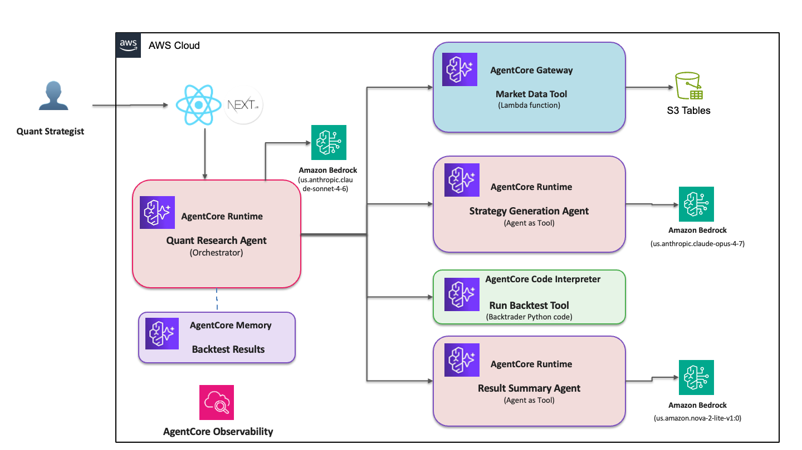

# Agentic Backtester

A multi-agent system that turns a plain-English trading idea into a backtested strategy. You describe a strategy in natural language; a team of specialized AI agents generates the strategy code, fetches historical market data, runs the backtest, and writes up the results — coordinated end-to-end on Amazon Bedrock AgentCore.

> **Portfolio / learning project.** Built on AWS's [`agentic_backtesting` sample](https://github.com/aws-samples/sample-tech-for-trading) (MIT-0), then extended and re-architected for local development — including replacing the original sample's imperative shell-script deployment with an **AWS CDK (Python)** infrastructure-as-code layer I own end to end. See [Roadmap](#roadmap) for what's original.

## Disclaimer

**This project is for educational and research purposes only.** The backtesting results, trading strategies, and any analysis it produces do not constitute financial advice, investment recommendations, or an offer to buy or sell any securities. Past performance does not guarantee future results. Trading and investing involve substantial risk of loss. Always consult a qualified financial advisor before making investment decisions.

## How it works

Four specialized agents, orchestrated by a Quant Agent, transform a trading idea into a backtested result:

1. **Strategy Generator** — converts a natural-language idea into executable [Backtrader](https://www.backtrader.com/) strategy code (Claude Opus, on AgentCore Runtime)
2. **Market Data tool** — fetches historical OHLCV data from S3 Tables (Iceberg), exposed via an AgentCore Gateway (MCP) secured with Cognito
3. **Backtest tool** — runs the generated strategy through Backtrader and returns performance metrics
4. **Results Summarizer** — turns raw metrics into a readable performance report (Amazon Nova, on AgentCore Runtime)

The **Quant Agent** (Claude Sonnet, on AgentCore Runtime) orchestrates all four via the Strands Agent SDK, with AgentCore Memory for chat continuity. A Next.js frontend provides the UI.

## Tech stack

- **Strands Agent SDK** — agent framework; `@tool` decorators expose Python functions as agent tools
- **Amazon Bedrock AgentCore** — Runtime (agent hosting), Gateway (MCP tools), Identity/Cognito (auth), Memory (chat state), Observability (traces/logs)
- **Amazon Bedrock models** — Claude Opus / Sonnet, Amazon Nova
- **S3 Tables (Apache Iceberg)** + **Lambda** — market data store and access
- **AWS CDK (Python)** — the backend (S3 Tables bucket, Lambda, Cognito, AgentCore Gateway + Target) is defined as two infrastructure-as-code stacks in [`infra/`](./infra)
- **Next.js 14 / React** — frontend

## Running it

Deployment and local-development instructions are in **[DEPLOYMENT_GUIDE.md](./DEPLOYMENT_GUIDE.md)**. In short: `cdk deploy` the backend (S3 Tables, Lambda, Gateway, Cognito) from [`infra/`](./infra) and load market data, deploy the three agents to AgentCore Runtime with the `agentcore` CLI, then run the Next.js frontend locally against the orchestrator.

## Roadmap

Extensions that make this project my own (in progress):

- [ ] Real market-data pipeline from Polygon (multi-symbol ingest beyond the sample's single stock)
- [ ] Parameter optimization / walk-forward testing

## Credits

Originally based on the AWS Samples [`sample-tech-for-trading`](https://github.com/aws-samples/sample-tech-for-trading) project (`agentic_backtesting/`), released under MIT-0. Extended and maintained by Jude Pereira.
